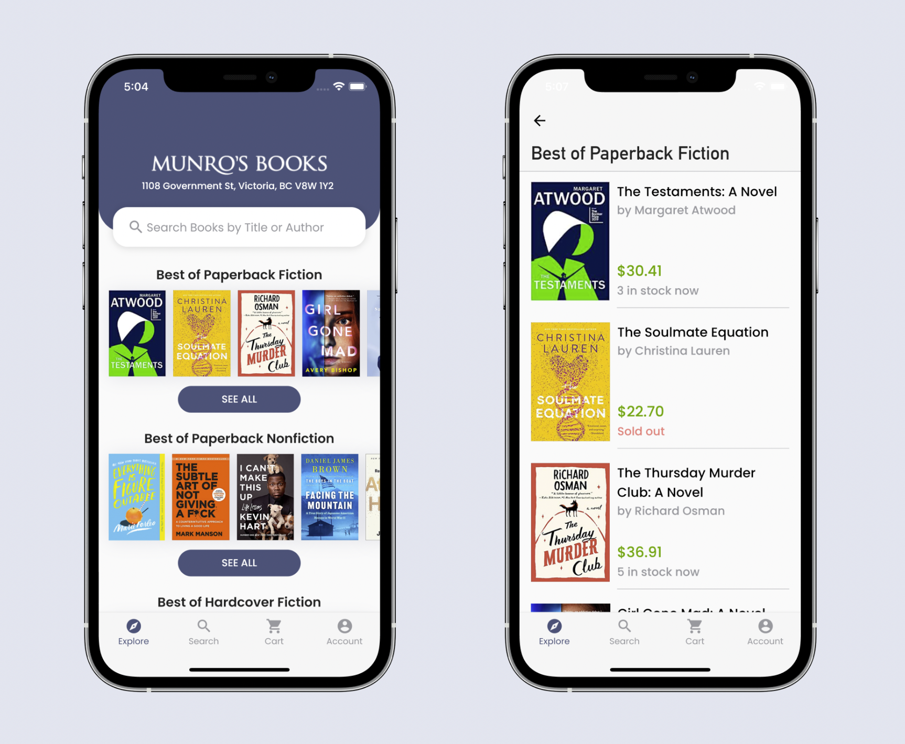
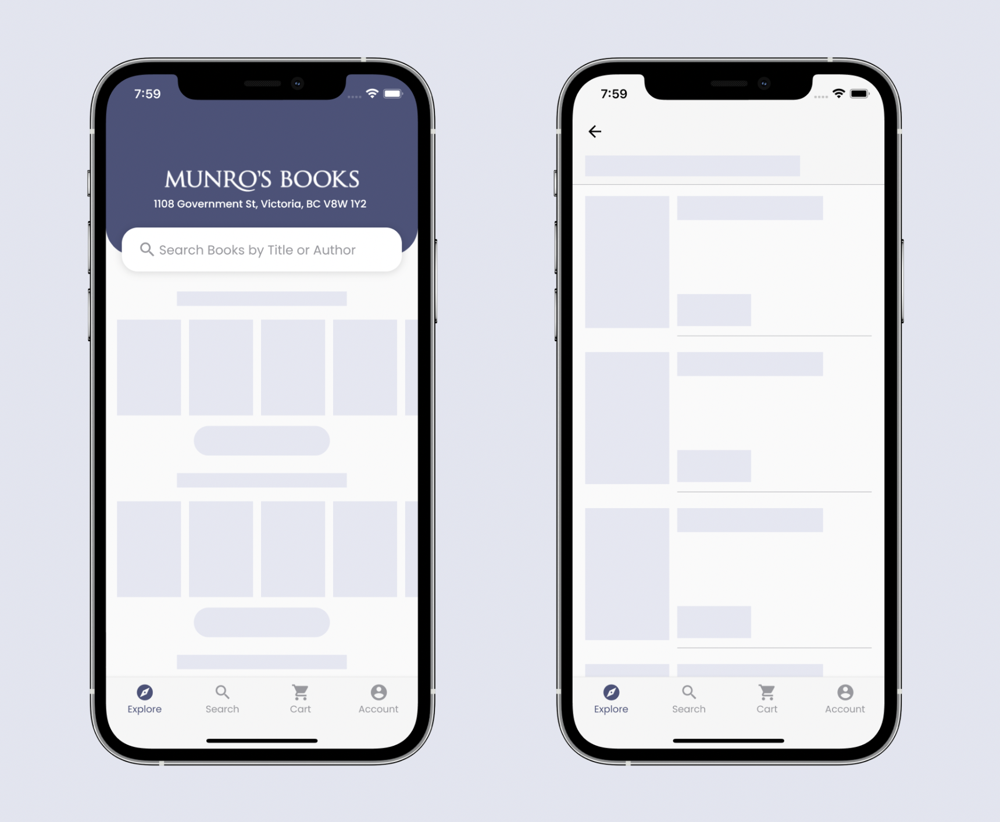
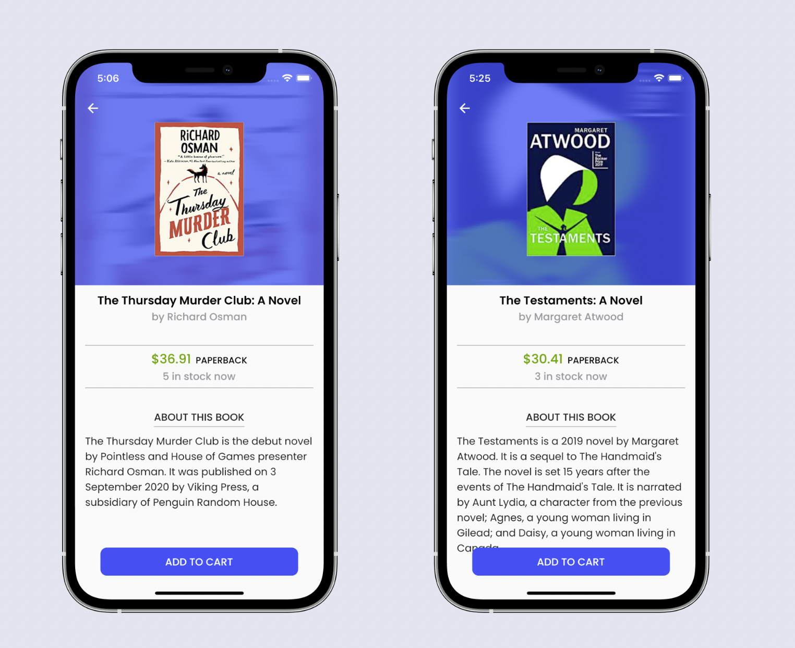
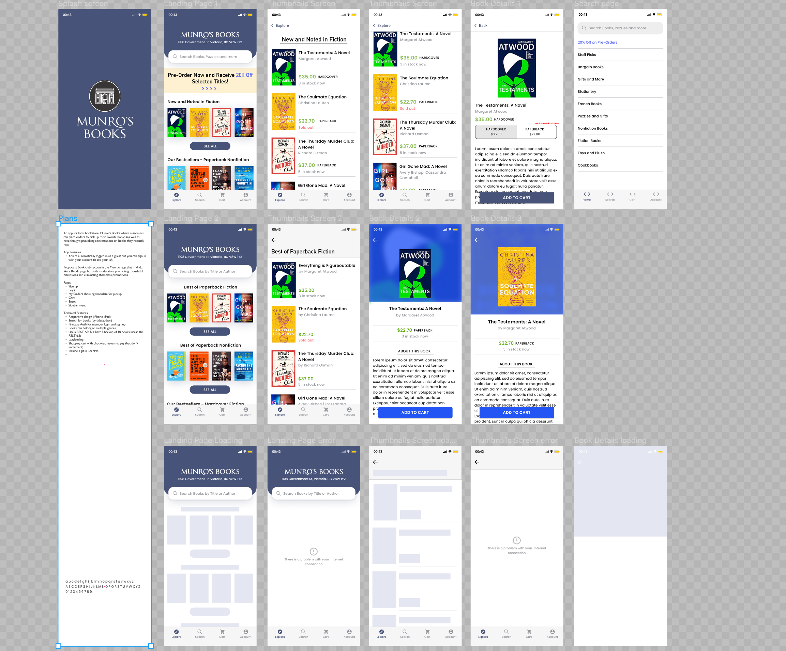

# Munro Books App

An iOS/android app I built for local bookstore, [Munro Books](https://www.munrobooks.com).

Disclaimer: This was done as a personal project and is no way affiliated with the original brand!! If you woud like to get some nice books for the summer you can head over to their website at [munrobooks.com](https://www.munrobooks.com).

    

    

 

    

 

## How this app was made

This app was built using the [flutter framework](https://flutter.dev/docs) and some additional external libraries from [pub.dev](https://pub.dev).
These include:

- flutter_bloc: for state management
- http: for making HTTP requests

My code for the backend is also on my github: click [here](https://github.com/josh-umahi/munro-books-API). It consists of a JSON API created with [json-server](https://github.com/typicode/json-server) and hosted on [Heroku](https://www.heroku.com/), a great platform for quickly deploying servers and much more.

### Below is the Figma prototype.

    

